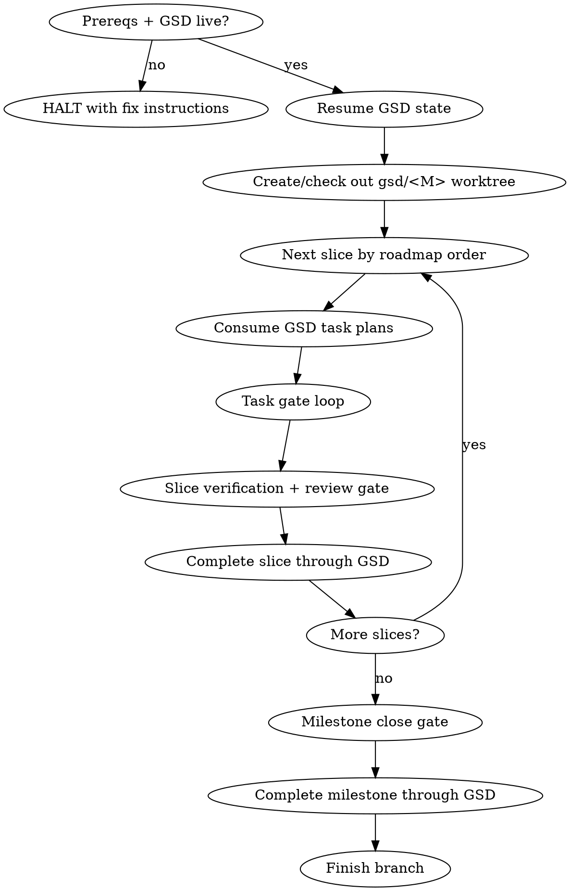

# GSD-PI x Superpowers Integration

## Overview

Orchestrate a GSD-PI milestone with Superpowers quality gates. GSD owns
structure and state. Superpowers owns execution discipline: worktree isolation,
subagent implementation, TDD, evidence-based verification, code review, and
branch completion.

**Core principle:** GSD complete state must never move ahead of verifiable
engineering state. A milestone is not complete until GSD state, git history,
tests, review, and gate artifacts agree.

**HARD GATE** marks steps that must not be skipped, reordered, or replaced with
informal notes unless the user explicitly approves a recorded deviation.

## Required Sub-Skills

Invoke these skills at the designated steps:

- **using-git-worktrees**: isolate milestone execution on `gsd/<MilestoneID>`.
- **writing-plans**: create missing slice/task plans only when GSD has none.
- **subagent-driven-development**: execute tasks with fresh implementer agents.
- **test-driven-development**: mandatory for logic, data, behavior, and bugfix tasks.
- **verification-before-completion**: fresh verification before any completion claim.
- **requesting-code-review** and **receiving-code-review**: slice and milestone gates.
- **systematic-debugging**: handle failures without prematurely asking the user.
- **finishing-a-development-branch**: finish with merge/PR options.
- **Task-type verification matrix**: see [references/mcp-and-test-strategy.md](references/mcp-and-test-strategy.md) when choosing between TDD and evidence-based verification.

## State Machine



## Phase 0: Prerequisites (HARD GATE)

1. Confirm Superpowers skills are available.
2. Confirm `.gsd/` exists at workspace root.
3. Confirm authoritative GSD access:
   - Prefer GSD MCP read-only status (`gsd_milestone_status` or `gsd_resume`).
   - If MCP is unavailable but `gsd headless query` works, continue only after
     recording a **CONTROLLED_CLI_FALLBACK** deviation in the user-visible
     handoff/gate artifact.
   - If neither MCP nor CLI query works, halt and explain how to start/fix GSD.
4. Confirm git worktree/branch:
   - Work on `gsd/<MilestoneID>`, never directly on `main`.
   - If using a separate code worktree, explicitly name which path owns code
     changes and which path owns `.gsd` state.

## Phase 1: Resume and Select Work

1. Load state with GSD, not `STATE.md`.
2. If an active milestone exists, resume from its active slice/task.
3. If no active milestone exists but unstarted milestones remain, ask the user
   which milestone to start unless the user already specified one.
4. If all milestones are complete, do not report success immediately. First run
   the Milestone Close Gate sanity checks against the latest completed
   milestone. If any gate is missing, follow **Invalid Complete State Protocol**.
   Report completion only when GSD state, git state, verification, review, and
   gate artifacts agree.
5. Read slices in roadmap/dependency order. Do not rely on folder order.

## Phase 2: Slice Loop

### Step 2.1: Planning

1. Read the slice goal and existing `Sxx-PLAN.md` / `Txx-PLAN.md` files.
2. GSD owns task breakdown. Use existing task plans exactly.
3. Invoke writing-plans only if GSD task plans are missing or unusably vague.
4. If a task plan is too vague to verify, harden that task plan before coding:
   define task type, acceptance checks, verification command, and expected gate
   artifact.

### Step 2.2: Task Gate Loop (HARD GATE)

For each task:

1. Dispatch a fresh implementer subagent with the full task text, relevant slice
   goal, constraints, and explicit file ownership. Do not make the implementer
   rediscover the whole milestone.
2. Classify the task:
   - **TDD task:** logic, data, persistence, network contract, behavior change,
     migration, sync, bugfix.
   - **Evidence task:** UI, UX, infra/build/config, docs, smoke/UAT.
3. For TDD tasks, require RED -> GREEN -> REFACTOR evidence. If production code
   was written before a failing test, delete that code and restart the task.
4. For evidence tasks, require concrete evidence such as screenshot, UI test,
   build output, smoke command, or documented manual acceptance. "Looks right" is
   not evidence.
5. The implementer must commit after the task passes its verification.
6. Before `gsd_complete_task`, fill a Task Gate record and verify:
   - `git status --short` contains only intentional changes for this task before
     commit, and is clean after commit.
   - The task has a commit SHA.
   - TDD/evidence commands were run freshly and their result is recorded.
7. Complete the task through GSD (`gsd_complete_task`) and save notable decisions
   through GSD (`gsd_save_decision`) when available.

#### Task Gate Template

```markdown
## TASK-GATE
- Task: Mxxx/Sxx/Txx
- Task type: TDD | Evidence
- Implementer: <agent/model or local>
- Plan source: <Txx-PLAN.md or GSD record>
- RED evidence: <command + expected failure, or N/A with reason>
- GREEN/evidence command: <command>
- Result: pass | fail
- Commit SHA: <sha>
- Dirty status after commit: <empty output from git status --short>
- GSD action: <gsd_complete_task id/output>
- Deviations: none | <CONTROLLED_* record>
```

### Step 2.3: Slice Verification and Review (HARD GATE)

After all tasks in a slice are complete:

1. Run full relevant verification with verification-before-completion.
2. Compute the incremental slice diff:
   - Prefer `git diff <previous-slice-completion-sha>..HEAD`.
   - If prior slice SHA is unavailable, explicitly list touched paths and why.
3. Dispatch a code-review subagent with slice requirements and incremental diff.
4. Fix Critical and Important findings through a fix subagent, then re-review.
5. Save the review result as a gate artifact before completing the slice.
6. Complete the slice through GSD only after:
   - tests/build pass,
   - review is approved or all blocking findings are resolved,
   - slice review artifact exists,
   - `git status --short` is clean.
7. Use GSD completion APIs/commands (`gsd_complete_slice`, `gsd_save_summary`,
   `gsd_save_gate_result`) when available. Do not hand-edit GSD projections as a
   normal completion path.

#### Slice Review Gate Template

```markdown
## SLICE-REVIEW-GATE
- Slice: Mxxx/Sxx
- Requirements: <Sxx-PLAN.md or GSD record>
- Base SHA: <previous-slice-completion-sha>
- Head SHA: <current HEAD>
- Diff scope: <git diff command or touched path list>
- Verification command: <full command>
- Verification result: pass | fail
- Reviewer: <agent/model>
- Findings: none | <Critical/Important/Minor list>
- Fix commits: none | <sha list>
- Re-review verdict: approved | blocked
- Gate artifact path: <path>
- GSD action: <gsd_save_gate_result / gsd_complete_slice output>
- Dirty status after slice: <empty output from git status --short>
```

## Phase 3: Milestone Close Gate (HARD GATE)

After all slices are complete:

1. Run final full verification from the milestone worktree.
2. Dispatch a final whole-branch code reviewer.
3. Verify all slice/task commits exist and are reachable from `HEAD`.
4. Verify `git status --short` is empty.
5. Verify UAT/smoke status:
   - Executed checks must include command, environment, result, and timestamp.
   - Documented-but-not-executed checks must be marked `deferred`, with owner,
     risk, and reason.
6. Verify artifact freshness:
   - milestone completion timestamp must not precede unfinished slice/task gates;
   - roadmap/checklist status must match GSD query state;
   - titles/IDs must not show recover-induced duplication.
7. Complete the milestone through GSD (`gsd_complete_milestone`) only after the
   close gate is satisfied.
8. Invoke finishing-a-development-branch to present merge/PR options.

#### Milestone Close Gate Template

```markdown
## MILESTONE-CLOSE-GATE
- Milestone: Mxxx
- Branch/worktree: <path + branch>
- Final verification command: <command>
- Final verification result: pass | fail
- Final reviewer: <agent/model>
- Final review verdict: approved | blocked
- Task commits present: yes | no
- Slice review gates present: yes | no
- UAT/smoke executed: <list>
- UAT/smoke deferred: <owner/risk/reason list>
- GSD query phase: <phase>
- Git dirty status: <empty output from git status --short>
- Timestamp monotonicity: pass | fail
- Recover/idempotency check: pass | fail | not needed
- GSD completion output: <gsd_complete_milestone output>
- Deviations: none | <CONTROLLED_* record>
```

## Gate Artifact Paths

Prefer these paths so future agents can audit the run without searching chat
history:

- Task gate: `.gsd/milestones/Mxxx/slices/Sxx/tasks/Txx-GATE.md`
- Slice review gate: `.gsd/milestones/Mxxx/slices/Sxx/Sxx-REVIEW-GATE.md`
- Milestone close gate: `.gsd/milestones/Mxxx/Mxxx-CLOSE-GATE.md`
- Completion repair/deviation: `.gsd/milestones/Mxxx/Mxxx-COMPLETION-REPAIR.md`

If the active GSD setup forbids direct artifact files, write the same fields
through GSD journal/gate tools and mirror the location or command output in the
handoff. Never leave gate evidence only in chat history.

## Dirty Worktree Classification

Before any task, slice, or milestone completion, run `git status --short` from
the milestone worktree and classify each entry:

- **Milestone-owned:** expected files for the current task/slice. Commit them.
- **Generated/throwaway:** build output or temporary files. Remove only if safe
  and inside the intended workspace.
- **Unrelated/user-owned:** changes outside current ownership. Do not revert or
  move them. Stop and ask the user unless they can be isolated from the milestone
  close gate.

The close gate requires a clean milestone worktree. If unrelated user-owned
changes remain in that same worktree, do not complete the milestone; record the
blocker and ask how to isolate them.

## Invalid Complete State Protocol

If GSD reports `phase=complete` but any hard gate is missing, treat the milestone
as **completion-invalid**, not complete.

1. Do not claim completion.
2. Do not manually roll back the GSD database unless the user explicitly asks and
   a supported GSD command exists.
3. Create or update `Mxxx-COMPLETION-REPAIR.md` with:
   - the GSD query output,
   - missing gates,
   - dirty worktree summary,
   - recover/deviation history,
   - proposed repair plan.
4. Repair gates forward: classify dirty changes, commit valid work, add missing
   review gates, run final verification, and produce `Mxxx-CLOSE-GATE.md`.
5. After repair, use GSD-supported commands/recover/query to restore consistency.

### Missing RED Evidence

TDD evidence cannot be recreated retroactively.

- If the task is still in progress and production code was written before RED,
  delete the production code and restart with RED -> GREEN.
- If the work is already integrated or historical, mark
  `TDD_EVIDENCE_MISSING`; add characterization/regression tests and review, but
  do not claim the task was TDD.
- Future related changes must resume strict TDD from the next behavior change.

## Recover and Deviation Protocol

`gsd headless recover` is a repair tool, not a verification command.

Use recover only when GSD projections/database are inconsistent or after an
approved CLI fallback. After recover:

1. Run `gsd headless query`.
2. Confirm milestone/slice/task IDs, statuses, active pointers, and titles are
   sane.
3. Check for duplicate title prefixes such as `M005: M005: ...`.
4. Re-check git clean status and gate artifacts.
5. Record the recover reason and output in the relevant gate artifact.

If MCP/provider/API access fails:

1. Try the configured GSD read path once more.
2. If a CLI fallback is available, tell the user what will be different.
3. Continue only with a `CONTROLLED_CLI_FALLBACK` deviation record.
4. Never mark task/slice/milestone complete solely because markdown files were
   manually edited.

## Exception Handling

Do not pause unless strictly necessary.

- Compile/test failures: use systematic-debugging.
- Review rejections: dispatch a fix subagent and re-review.
- Missing credentials: try secure credential collection if available; otherwise
  ask the user.
- Same root cause fails three consecutive fix attempts: stop and ask the user.

Track repeated failures yourself because subagents do not share memory. Save
notable failed attempts through GSD decisions/journal when available.

## Red Flags

| Thought | Reality |
|---|---|
| "GSD says complete, so we are done." | Not unless git, tests, review, and gate artifacts agree. |
| "I'll commit later." | Task completion requires commit provenance now. |
| "Tests pass, so TDD happened." | Passing tests alone do not prove RED-first. Record RED/GREEN evidence. |
| "This UI has no test, so no verification." | Use screenshot, behavior evidence, UI test, or documented manual UAT. |
| "Recover passed, so verification passed." | Recover repairs state. It is not product verification. |
| "I'll review the whole branch each time." | Review only the incremental slice diff. |
| "I'll update SUMMARY.md by hand." | Use GSD completion/gate commands; manual projection edits are deviations. |
| "Smoke scenario is documented, so it passed." | Documentation is not execution. Mark unexecuted smoke as deferred. |
| "The task is simple, no subagent needed." | This skill requires subagent-driven task execution unless the user explicitly approves a deviation. |
| "The worktree is dirty but milestone complete." | Dirty worktree means the milestone is not ready to close. |

## Worked Example

Task `M005/S03/T01` adds shift calculation helpers.

1. Resume GSD state and check out `gsd/M005`.
2. Dispatch implementer subagent with `T01-PLAN.md`, slice goal, and owned files.
3. Classify as TDD because it changes date/time logic.
4. RED: write boundary test for `00:00`, run targeted test, confirm expected fail.
5. GREEN: implement minimal helper, run targeted test and full suite.
6. Commit: `feat(M005-S03-T01): add shift schedule utilities`.
7. Fill TASK-GATE with RED/GREEN output and commit SHA.
8. Complete task through GSD.
9. After all S03 tasks, run full verification, request incremental slice review,
   fix/re-review if needed, save SLICE-REVIEW-GATE, then complete S03 through GSD.

## Final Rule

Do not claim completion from a single signal. A GSD milestone is complete only
when the GSD state, git history, verification evidence, review artifacts, and
handoff/finish state all agree.
